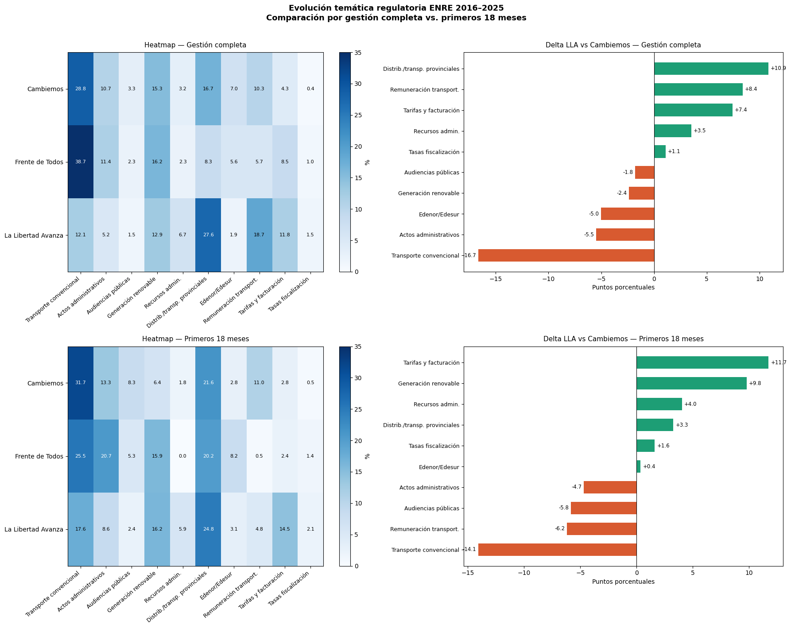
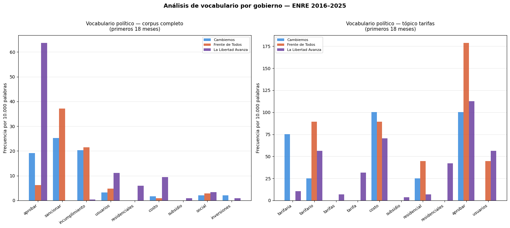
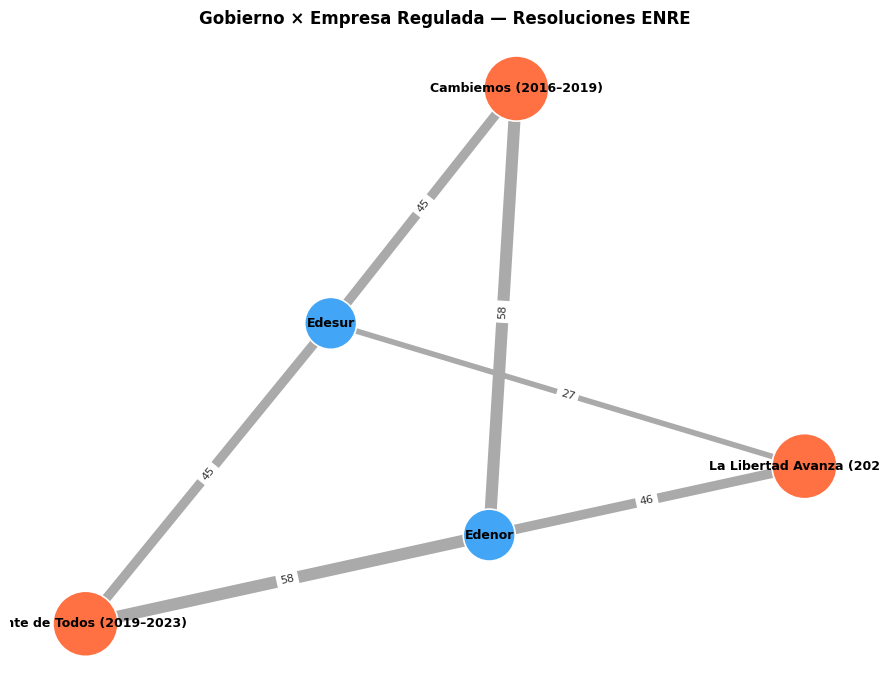

# Análisis Regulatorio del ENRE — NLP sobre la Regulación Eléctrica Argentina (2016–2025)

> ⚠️ **Trabajo en curso.** Este es un abordaje exploratorio inicial. Los hallazgos y la metodología están sujetos a revisión.

Análisis computacional de texto sobre 1.873 resoluciones del ente regulador eléctrico argentino (ENRE) a lo largo de tres gestiones de gobierno, utilizando BERTopic para el descubrimiento no supervisado de tópicos.

---

## Pregunta de Investigación

> *¿Cómo cambiaron las prioridades regulatorias del sector eléctrico argentino a lo largo de las gestiones de Cambiemos (2016–2019), Frente de Todos (2019–2023) y La Libertad Avanza (2023–)?*

Es una pregunta que cualquier analista de política energética reconocería — pero que nunca había sido respondida con datos sistemáticos. Este proyecto aborda ese vacío aplicando NLP al corpus completo de resoluciones del ENRE publicadas en el Boletín Oficial argentino.

---

## Qué Hace Este Proyecto

1. **Descarga** el dataset completo de normativa nacional de InfoLEG (~424.000 normas) desde el portal de datos abiertos de Argentina
2. **Filtra** hasta obtener 1.873 resoluciones del ENRE publicadas entre 2016 y 2025
3. **Preprocesa** el texto: elimina lenguaje legal repetitivo (boilerplate), remueve stopwords, normaliza
4. **Entrena BERTopic** usando un SentenceTransformer multilingüe (`paraphrase-multilingual-MiniLM-L12-v2`) para descubrir 10 clusters temáticos regulatorios
5. **Recupera outliers** mediante reglas léxicas (163 de 186 resoluciones no clasificadas fueron reclasificadas)
6. **Compara** la distribución de tópicos entre gestiones usando una ventana equivalente de 18 meses para controlar el sesgo de madurez de gobierno
7. **Visualiza** resultados: mapas de calor, series de tiempo y grafos de red interactivos (PyVis)

---

## Hallazgos Principales

| Hallazgo | Detalle |
|---|---|
| **LLA gobierna mediante aprobación, no sanción** | La Libertad Avanza usa "aprobar" con mucha más frecuencia que "sancionar", en relación con gestiones anteriores |
| **Las resoluciones de tarifas se triplican bajo LLA** | El tópico "Tarifas y facturación" se triplica en la ventana comparable de 18 meses |
| **Las conexiones de energía renovable son altas tanto en FdT como en LLA** | Contrario a lo esperado, las resoluciones de conexión renovable a la red no se concentran bajo Cambiemos |
| **Caída sostenida de las audiencias públicas** | A lo largo de las tres gestiones — un debilitamiento estructural de los mecanismos regulatorios participativos |

---

## Resultados y Visualizaciones

### Evolución temática por gestión



Heatmaps y gráficos de delta comparando la distribución porcentual de los 10 tópicos regulatorios entre Cambiemos, Frente de Todos y La Libertad Avanza — tanto para la gestión completa como para una ventana equivalente de primeros 18 meses (que controla el sesgo de madurez de gobierno). Los deltas más marcados de LLA vs. Cambiemos: **Distrib./transp. provinciales** (+10,9 p.p. en gestión completa), **Tarifas y facturación** (+7,4 p.p. gestión completa / +11,7 p.p. en 18 meses) y **Transporte convencional** (–16,7 p.p. gestión completa), el mayor retroceso relativo.

### Vocabulario político por gobierno



Análisis de keyness léxico (frecuencia normalizada por 10.000 palabras) sobre el corpus completo y sobre el tópico de tarifas específicamente, en los primeros 18 meses de cada gestión. Se observa el salto de "aprobar" bajo LLA frente al uso más frecuente de "sancionar" en Frente de Todos, y una mayor presencia de vocabulario ligado a costos y usuarios residenciales.

### Red — Gobierno × Empresa Regulada



Grafo bipartito que conecta cada gestión de gobierno con las distribuidoras reguladas (Edenor/Edesur), donde el grosor de la arista y la etiqueta numérica representan el volumen de resoluciones. El notebook también genera una versión interactiva (`red_distribuidoras.html`, zoom, arrastre de nodos, tooltips) pensada para exploración en vivo, pero para el README se usa esta versión estática porque las etiquetas del HTML son blancas sobre fondo oscuro y no se ven al recortarlas como imagen fija.

---

## Taxonomía de Tópicos (10 clusters)

| Tópico | Descripción |
|---|---|
| Acceso y ampliación de transporte convencional | Acceso a la red y expansión de la transmisión convencional |
| Conexión de generación renovable al SADI | Conexión de energía renovable a la red (desagregado del Tópico 0 mediante reglas léxicas) |
| Regulación y sanciones Edenor/Edesur | Distribuidoras del área metropolitana de Buenos Aires — sanciones y cumplimiento |
| Tarifas y facturación | Fijación de tarifas, facturación y ajustes de precios |
| Remuneración a transportistas | Remuneración de las empresas de transmisión |
| Regulación de distribuidoras provinciales | Regulación de la distribución y transmisión provincial |
| Recursos administrativos | Recursos administrativos |
| Actos administrativos y procedimientos | Actos y procedimientos administrativos |
| Audiencias públicas | Audiencias públicas |
| Tasas de fiscalización | Tasas de fiscalización |

---

## Stack Tecnológico

- **Python 3** (Google Colab)
- `BERTopic` — modelado de tópicos no supervisado
- `sentence-transformers` — embeddings multilingües (`paraphrase-multilingual-MiniLM-L12-v2`)
- `UMAP` + `HDBSCAN` — reducción de dimensionalidad y clustering
- `pandas` — construcción del corpus y asignación de tópicos
- `matplotlib` — visualizaciones comparativas
- `networkx` + `pyvis` — grafos de red interactivos (gobierno × entidad regulada)
- API de datos abiertos de InfoLEG — fuente de datos primaria

---

## Estructura del Repositorio

```
enre-nlp-regulatory-analysis/
├── ENRE.ipynb                          # Pipeline completo — ejecutar en Google Colab
├── analisis_comparativo_enre.png       # Heatmaps + deltas (gestión completa y 18 meses)
├── vocabulario_politico_enre.png       # Análisis de keyness léxico
├── red_distribuidoras.png              # Versión estática de la red (labels visibles)
└── README.md
```

**Nota:** Los archivos intermedios `enre_corpus.csv`, `enre_final.csv` y `red_distribuidoras.html` se generan al ejecutar el notebook. No están incluidos en el repositorio debido al tamaño de los datos fuente (~150 MB) y, en el caso del HTML, por tratarse de un artefacto interactivo generado en cada corrida.

---

## Cómo Ejecutarlo

1. Abrir `ENRE.ipynb` en [Google Colab](https://colab.research.google.com/)
2. Ejecutar la Celda 1 — instala `pdfplumber`, `requests`, `beautifulsoup4`, `tqdm`
3. Ejecutar la Celda 2 — descarga el dataset completo de InfoLEG (~150 MB en ZIP, ~3 min)
4. Ejecutar las Celdas 3 a 6 — filtra las resoluciones del ENRE, asigna gestiones de gobierno, guarda el corpus
5. Ejecutar la Celda 7 — instala `bertopic`, `sentence-transformers`, `umap-learn`, `hdbscan`
6. Ejecutar las Celdas 8 en adelante — pipeline completo de NLP, modelado de tópicos, análisis y visualizaciones

**Tiempo de ejecución:** ~25–40 minutos en el nivel gratuito de Colab (el paso de embeddings es el cuello de botella).

---

## Notas Metodológicas

- **Corpus:** 1.873 resoluciones del ENRE (2016–2025), utilizando los campos `titulo_sumario` + `texto_resumido` de InfoLEG
- **Recuperación de outliers:** 163/186 outliers reclasificados mediante reglas de palabras clave; 23 permanecen sin clasificar (<1,3% del corpus)
- **Ventana comparativa:** se utilizan ventanas equivalentes de 18 meses para la comparación entre gestiones, a fin de controlar las distintas duraciones de cada gobierno
- **Limitación:** la cobertura del texto completo de las resoluciones (`texto_original`) es parcial — el contenido scrapeado por InfoLEG varía según el año. El modelado de tópicos se basa en resúmenes, lo que puede subrepresentar el contenido técnico de las resoluciones más extensas
- **Próximos pasos:** extender el análisis a ENARGAS para comparar con el sector gasífero; aplicar análisis de keyness sobre el texto completo una vez resuelto el pipeline de scraping

---

## Autor

**Mariano Romero**
Politólogo | Buenos Aires, Argentina
Maestría en Economía y Regulación Energética — CEARE, UBA Facultad de Derecho
[LinkedIn](https://www.linkedin.com/in/marianoromero23)
